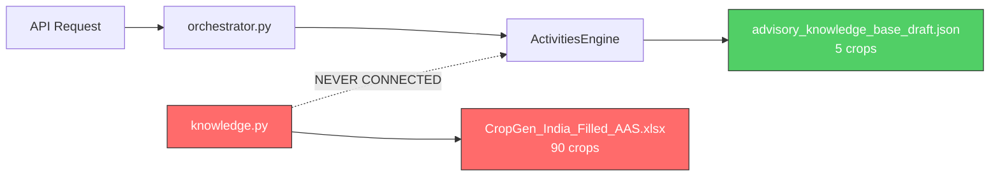

# 🔍 CropGen Advisory Engine — Deep Audit Report

## Executive Summary

The advisory engine has **two completely disconnected knowledge systems** and a **critical data-loading bug** that means the 90-crop Excel data is **never actually used** at runtime. The engine currently runs on a 5-crop hardcoded JSON, and 85 out of 90 crops silently receive generic "unknown crop" fallback advice.

---

## 1. The 5-Crop vs 90-Crop Question

### Which source is "correct"?

| Source | File | Crops | Role |
|--------|------|-------|------|
| **Excel** | [CropGen_India_Filled_AAS.xlsx](file:///Users/ashtikar/Developer/cropgen-advisory/advisory/data/CropGen_India_Filled_AAS.xlsx) | **90 crops** | Rich, per-crop agronomist-curated data (GDD, soil thresholds, chemicals, doses) |
| **JSON** | [advisory_knowledge_base_draft.json](file:///Users/ashtikar/Developer/cropgen-advisory/advisory/data/advisory_knowledge_base_draft.json) | **5 crops** (Tomato, Wheat, Paddy, Chili, Cotton) | Draft KB used as a prototype to build the rule engine |

> [!IMPORTANT]
> **The Excel is the authoritative source.** It has 90 crops with agronomist-filled parameters across 4 sheets (Phenology, Irrigation, Crop Protection, Nutrition). The JSON was a quick 5-crop draft used to prototype the engine logic. The plan was always to scale to 90 crops, but the engine was never updated to consume the Excel data.

### Naming Mismatches Between Sources

| JSON KB Name | Excel Name | Impact |
|---|---|---|
| `Paddy` | `Rice` | Lookups will fail — crop won't be found |
| `Chili` | `Chilli` | Lookups will fail — crop won't be found |

Even if the two systems were connected, these naming mismatches would cause silent fallback to defaults for 2 of the 5 JSON crops.

---

## 2. Critical Bugs

### 🔴 BUG #1: `knowledge.py` Cannot Load the Excel (Data Shape Mismatch)

**Severity: CRITICAL — The entire Excel knowledge base is dead code**

The Excel is **transposed** (crops are *columns*, parameters are *rows*). But [knowledge.py](file:///Users/ashtikar/Developer/cropgen-advisory/advisory/core/knowledge.py#L49-L61) iterates *rows* and looks for a `"Crop"` or `"Crop_Name"` column — which doesn't exist:

```python
# knowledge.py line 49-51 — BROKEN
for _, row in df.iterrows():
    crop_name = str(row.get("Crop", row.get("Crop_Name", ""))).strip().lower()
    # ^ Always returns "" because there's no "Crop" column!
```

The Excel's actual structure per sheet:
- **Row 0**: `Parameter Name` = "Base Temperature", **Columns**: `Amla`, `Apple`, ..., `Wheat` (90 crop columns)
- **Row 1**: `Parameter Name` = "Total Growing Days", values per crop column

**Result**: `self.crops_db` is always **empty**. `get_crop()` always returns `DEFAULT_CROP_DATA`.

---

### 🔴 BUG #2: `knowledge.py` is Never Used by the Engine

**Severity: CRITICAL — Two disconnected knowledge systems**

The actual advisory engine ([autonomous_activities_engine.py](file:///Users/ashtikar/Developer/cropgen-advisory/advisory/core/autonomous_activities_engine.py#L16-L21)) loads the **JSON file** directly:

```python
class ActivitiesEngine:
    def __init__(self, knowledge_base_path: str):
        with open(knowledge_base_path) as f:
            self.kb = json.load(f)
```

The orchestrator ([orchestrator.py](file:///Users/ashtikar/Developer/cropgen-advisory/advisory/services/orchestrator.py#L10)) confirms:

```python
KB_PATH = os.path.join(..., "advisory_knowledge_base_draft.json")
engine = ActivitiesEngine(KB_PATH)
```

Meanwhile, `knowledge.py` creates a singleton `kb_manager = KnowledgeBaseManager()` that loads the Excel — but **nothing ever calls it**. It's imported in [core/__init__.py](file:///Users/ashtikar/Developer/cropgen-advisory/advisory/core/__init__.py) but never referenced by the engine or orchestrator.



---

### 🔴 BUG #3: 85 out of 90 Crops Get Empty/Useless Advice

**Severity: CRITICAL — Silent failure for most crops**

When a crop not in the JSON's 5-crop list is requested (e.g., "Mango", "Potato", "Rice"), [_unknown_crop_defaults()](file:///Users/ashtikar/Developer/cropgen-advisory/advisory/core/autonomous_activities_engine.py#L343-L352) returns:

```python
{"type": "SPRAY", "message": "Crop 'Mango' not in knowledge base. Monitor conditions manually."}
{"type": "FERTIGATION", "message": "Crop 'Mango' not in knowledge base. No recommendation available."}
# ... same for all 7 activities
```

This is **not useful advisory** — the farmer gets zero actionable information for 85 crops.

---

### 🟡 BUG #4: `ideal_range` Lookup Hits Wrong Key

**Severity: MEDIUM**

In [_decide_irrigation()](file:///Users/ashtikar/Developer/cropgen-advisory/advisory/core/autonomous_activities_engine.py#L209):

```python
ideal_range = crop_kb.get("ideal_range", "50-65%")
```

But the JSON knowledge base has this under `irrigation_decision_engine.soil_moisture_thresholds_by_crop.{Crop}.ideal_range`, **not** directly in the crop object. The crop object at `kb["crops"]["Tomato"]` doesn't have an `ideal_range` key, so it always falls back to the hardcoded `"50-65%"`.

---

### 🟡 BUG #5: Misleading "No Spray" Message

**Severity: MEDIUM — Confusing farmer-facing text**

In [_decide_spray()](file:///Users/ashtikar/Developer/cropgen-advisory/advisory/core/autonomous_activities_engine.py#L149-L152), when no spray is needed:

```python
"message": "Do not spray today. Wind high or rain expected. Skip spray today." if wind_speed > 20
    else "Disease pressure low. No chemical spray needed. Continue regular monitoring."
```

If `wind_speed` is 25 (> 20 but ≤ 40), it says "Wind high or rain expected" — but this path is only reached *after* the wind > 40 check already passed. So the message is **factually wrong** — wind at 25 km/h is not "high" enough to block spraying, yet the message implies it is.

---

## 3. Hardcoded Values That Should Come from Data

### 🟠 Issue #6: All Chemical Lookups are Hardcoded for 5 Crops

**Severity: HIGH — Blocks scaling to 90 crops**

These methods in [autonomous_activities_engine.py](file:///Users/ashtikar/Developer/cropgen-advisory/advisory/core/autonomous_activities_engine.py#L357-L403) have hardcoded 5-crop dictionaries:

| Method | Lines | Hardcoded for |
|--------|-------|---------------|
| [_get_fungicide_for_crop()](file:///Users/ashtikar/Developer/cropgen-advisory/advisory/core/autonomous_activities_engine.py#L357-L365) | 357-365 | Tomato, Wheat, Paddy, Chili, Cotton |
| [_get_insecticide_for_crop()](file:///Users/ashtikar/Developer/cropgen-advisory/advisory/core/autonomous_activities_engine.py#L367-L375) | 367-375 | Tomato, Wheat, Paddy, Chili, Cotton |
| [_get_dose()](file:///Users/ashtikar/Developer/cropgen-advisory/advisory/core/autonomous_activities_engine.py#L377-L385) | 377-385 | 5 chemicals only |
| [_get_fertilizer_for_crop()](file:///Users/ashtikar/Developer/cropgen-advisory/advisory/core/autonomous_activities_engine.py#L387-L395) | 387-395 | Paddy, Wheat, Chili, Cotton |
| [_get_fertilizer_dose()](file:///Users/ashtikar/Developer/cropgen-advisory/advisory/core/autonomous_activities_engine.py#L397-L403) | 397-403 | 3 fertilizers only |

The Excel already has **per-crop** fungicide names, insecticide names, and dosages for all 90 crops — but they're never read.

---

### 🟠 Issue #7: Hardcoded Carbon Values

**Severity: MEDIUM**

In [orchestrator.py](file:///Users/ashtikar/Developer/cropgen-advisory/advisory/services/orchestrator.py#L40-L42):

```python
carbon_emission = 150.0   # Always 150
carbon_captured = 450.0   # Always 450
carbon_net = -300.0       # Always -300
```

Every advisory response returns the same carbon numbers regardless of crop, field size, or farming practices.

---

### 🟠 Issue #8: Hardcoded Yield Prediction

**Severity: MEDIUM**

In [orchestrator.py](file:///Users/ashtikar/Developer/cropgen-advisory/advisory/services/orchestrator.py#L95-L100):

```python
yield_data=YieldPrediction(
    standardYield=20.5,
    aiYield=22.1,
    unit="Quintals/Acre",
    explanation="AI prediction is higher due to optimal GDD accumulation."
)
```

Every crop gets the same 20.5 vs 22.1 quintals/acre yield prediction — even for crops like Tea or Rubber where quintals/acre makes no sense.

---

## 4. Agronomic & Logic Errors

### 🟠 Issue #9: Chlorpyrifos Listed as Fungicide

In the JSON KB and engine, `Chlorpyrifos 20%EC` is listed as a **fungicide** for Wheat, Paddy, and Chili ([lines 18-20](file:///Users/ashtikar/Developer/cropgen-advisory/advisory/data/advisory_knowledge_base_draft.json)):

```json
"fungal_risk": {
    "chemicals": {
        "Wheat": "Chlorpyrifos 20%EC",   // ← This is an INSECTICIDE
        "Paddy": "Chlorpyrifos 20%EC",   // ← This is an INSECTICIDE
        "Chili": "Chlorpyrifos 20%EC"    // ← This is an INSECTICIDE
    }
}
```

> [!CAUTION]
> **Chlorpyrifos is an organophosphate insecticide, NOT a fungicide.** Recommending it for fungal diseases is agronomically incorrect and could harm the crop while not treating the actual fungal infection. The Excel data has correct per-crop fungicides (e.g., Mancozeb for Tomato).

---

### 🟠 Issue #10: Water Hours Calculation is Crop-Agnostic

In [_calculate_water_hours()](file:///Users/ashtikar/Developer/cropgen-advisory/advisory/core/autonomous_activities_engine.py#L405-L407):

```python
def _calculate_water_hours(self, soil_moisture: float, crop: str) -> float:
    deficit = max(0, 40 - soil_moisture)  # Hardcoded 40% target for ALL crops
    return round((deficit / 10) * 0.5, 1)
```

- The `crop` parameter is accepted but **never used**
- Target moisture is hardcoded at 40% — but Paddy/Rice needs 60-80%, while Cotton is fine at 50-65%
- The `* 13` mm estimate in `_decide_irrigation()` (line 219) is arbitrary

---

### 🟡 Issue #11: NDVI-Based Health Score is Naive

In [orchestrator.py](file:///Users/ashtikar/Developer/cropgen-advisory/advisory/services/orchestrator.py#L29):

```python
health_score = min(100, max(0, int((ndvi_val / 0.8) * 100)))
```

This assumes NDVI = 0.8 = 100% health for **all crops**. But peak NDVI varies by crop — dense canopy crops like sugarcane can reach 0.9+, while sparse crops like cotton may peak at 0.65. An NDVI of 0.6 is "poor" for rice but "normal" for young cotton.

---

### 🟡 Issue #12: Soil Moisture Unit Conversion is Fragile

In [orchestrator.py](file:///Users/ashtikar/Developer/cropgen-advisory/advisory/services/orchestrator.py#L33-L34):

```python
soil_moist = request.weather.current.soil_moisture_15cm
sm_pct = soil_moist * 100 if soil_moist < 1.0 else soil_moist
```

This assumes values < 1.0 are fractions and ≥ 1.0 are already percentages. But soil moisture of exactly 1.0 (= 100%) would be treated as "1%" instead of "100%". This edge case could cause a critical false irrigation alert for waterlogged soils.

---

## 5. Architectural Issues

### 🟡 Issue #13: No Forecast Weather Data Used

The request schema accepts a rich [ForecastWeather](file:///Users/ashtikar/Developer/cropgen-advisory/advisory/schemas/request.py#L26-L34) object with 7-day forecasts for temp, humidity, wind, ET, and rain. But the engine only uses:

- `sum(precipitation[:5])` — total rainfall as a single number
- Nothing from forecast temperature, humidity, wind, or ET arrays

This means the engine cannot do **proactive scheduling** (e.g., "spray tomorrow because humidity will spike on day 3").

---

### 🟡 Issue #14: Water Stress Data is Ignored

The request schema accepts a [WaterData](file:///Users/ashtikar/Developer/cropgen-advisory/advisory/schemas/request.py#L46-L50) object with `waterLatest`, `waterMean`, `stressLevel`, and `confidence` — but **none of it is ever passed to the engine**.

---

### 🟡 Issue #15: NDVI Trend is Ignored

The request includes `ndviTrend` (rate of change) which is critical for detecting rapid crop decline — but only `ndviLatest` is used. The JSON KB even has a rule for "NDVI drop > 0.05 in 1 week" but it's never implemented.

---

### 🟡 Issue #16: No Error Handling for Missing Forecast Data

In [orchestrator.py](file:///Users/ashtikar/Developer/cropgen-advisory/advisory/services/orchestrator.py#L36):

```python
rainfall_forecast = sum(request.weather.forecast.precipitation[:5]) if request.weather.forecast.precipitation else 0.0
```

If the list has fewer than 5 elements, this silently sums fewer days. No warning is raised that the forecast is incomplete.

---

### 🟡 Issue #17: Engine Silently Swallows All Exceptions

In [routes.py](file:///Users/ashtikar/Developer/cropgen-advisory/advisory/routes/api/routes.py#L14-L20):

```python
except Exception as e:
    return AdvisoryResponseSchema(
        success=False,
        message=str(e),  # Raw exception text sent to client
        ...
    )
```

This catches **everything** (including bugs) and returns `success=False` with a raw traceback message. No logging, no alerting.

---

## Summary of All Issues by Severity

| # | Severity | Issue | Category |
|---|----------|-------|----------|
| 1 | 🔴 CRITICAL | `knowledge.py` can't load transposed Excel — `crops_db` always empty | Data Loading Bug |
| 2 | 🔴 CRITICAL | `knowledge.py` (Excel) is never connected to `ActivitiesEngine` (JSON) | Architecture |
| 3 | 🔴 CRITICAL | 85/90 crops get useless "not in knowledge base" fallbacks | Data Gap |
| 4 | 🟡 MEDIUM | `ideal_range` looked up from wrong JSON path | Logic Bug |
| 5 | 🟡 MEDIUM | Misleading spray message for moderate wind | UX Bug |
| 6 | 🟠 HIGH | All chemical/dose lookups hardcoded for 5 crops | Scalability |
| 7 | 🟠 MEDIUM | Carbon values hardcoded (150/450/-300) | Hardcoding |
| 8 | 🟠 MEDIUM | Yield prediction identical for all crops | Hardcoding |
| 9 | 🟠 HIGH | Chlorpyrifos incorrectly classified as fungicide | Agronomic Error |
| 10 | 🟠 MEDIUM | Water hours calc ignores crop parameter | Logic Bug |
| 11 | 🟡 MEDIUM | NDVI→health assumes 0.8 = 100% for all crops | Agronomic Error |
| 12 | 🟡 MEDIUM | Soil moisture unit conversion breaks at exactly 1.0 | Edge Case Bug |
| 13 | 🟡 MEDIUM | Forecast weather arrays unused (only rain sum) | Missing Feature |
| 14 | 🟡 MEDIUM | Water stress data completely ignored | Missing Feature |
| 15 | 🟡 MEDIUM | NDVI trend ignored despite being in schema | Missing Feature |
| 16 | 🟡 LOW | Incomplete forecast data handled silently | Robustness |
| 17 | 🟡 LOW | All exceptions swallowed, no logging | Observability |

---

## Recommended Fix Priority

### Phase 1 — Fix the Data Foundation (Bugs #1, #2, #3)
1. **Rewrite `knowledge.py`** to correctly parse the transposed Excel (crops-as-columns)
2. **Rewire `ActivitiesEngine`** to load from the parsed Excel data instead of the 5-crop JSON
3. **Retire the JSON KB** or auto-generate it from the Excel for backward compatibility
4. **Normalize crop names** (Paddy↔Rice, Chili↔Chilli) with an alias map

### Phase 2 — Remove Hardcoding (Bugs #6, #9, #10)
1. Replace all hardcoded chemical/dose dictionaries with Excel lookups
2. Fix Chlorpyrifos fungicide misclassification  
3. Make water calculation crop-aware using Excel thresholds

### Phase 3 — Use Available Data (Bugs #13, #14, #15)
1. Incorporate forecast arrays for proactive scheduling
2. Use NDVI trend for decline detection
3. Use water stress data in irrigation decisions

Would you like me to proceed with implementing these fixes?


Great call — let me walk you through the plan clearly before touching any code.

---
